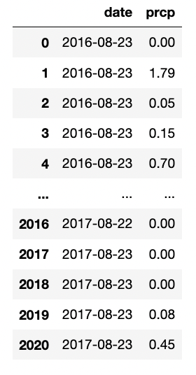
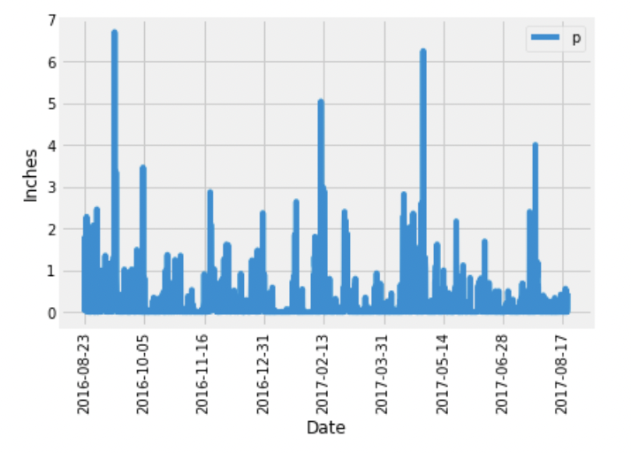
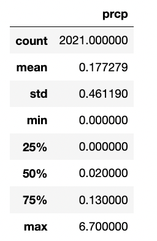

## Climate Analysis

Analyzes Climate Data using Python, SQLAlchemy Queries and a Flask API

## Objective #1: Analyze and Explore the Climate Data

### Step 1 - Create Database

* Use the SQLAlchemy create_engine() function to connect to the SQLite database
* Use the SQLAlchemy automap_base() function to reflect the tables into classes, and then save references to the classes named station and measurement
* Link Python to the database by creating a SQLAlchemy session

### Step 2 - Precipitation Analysis

* Find the most recent date in the dataset
* Using that date, get the previous 12 months of precipitation data by querying the previous 12 months of data
* Select only the "date" and "prcp" values
* Load the query results into a Pandas DataFrame, set the index to the "date" column and sort the DataFrame values by "date".

* Plot the results by using the DataFrame plot method

* Use Pandas to print the summary statistics for the precipitation data

### Step 3 - Station Analysis

*  Design a query to calculate the total number of stations in the dataset
* Design a query to find the most-active stations 
    * List the stations and observation counts in descending order.
* Design a query that calculates the lowest, highest, and average temperatures that filters on the most-active station id found in the previous query
* Design a query to get the previous 12 months of temperature observation (TOBS) data
    * Plot the results as a histogram

---------------------------------------------------

## Objective #2: Design A Climate App

### Step 4 - Flask API

* Design a Flask API based on the queries that were just developed
* Create the routes for each page
    */
        * Start at the homepage
        * List all the available routes
    * /api/v1.0/precipitation
        * Convert the query results from the precipitation analysis to a dictionary using date as the key and prcp as the value
        * Return the JSON representation of your dictionary
    * /api/v1.0/stations
        * Return a JSON list of stations from the dataset
    * /api/v1.0/tobs
        * Query the dates and temperature observations of the most-active station for the previous year of data
        * Return a JSON list of temperature observations for the previous year
    * /api/v1.0/<start> and /api/v1.0/<start>/<end>
        * Return a JSON list of the minimum temperature, the average temperature, and the maximum temperature for a specified start or start-end range
        * For a specified start, calculate TMIN, TAVG, and TMAX for all the dates greater than or equal to the start date
        * For a specified start date and end date, calculate TMIN, TAVG, and TMAX for the dates from the start date to the end date, inclusive

---------------------------------------------------

<b>Contact:</b> bronwynmilne64@gmail.com
